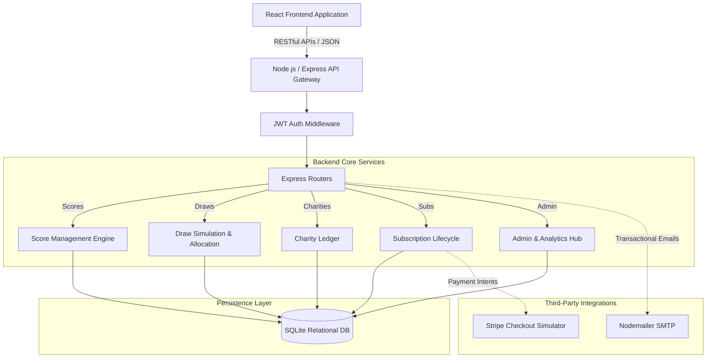

# 🏌️‍♂️ GolfGives: Full-Stack Platform

> **Golf. Give. Win.** An enterprise-grade, subscription-driven golf performance tracking, charity fundraising, and monthly draw platform. 


---

## 📖 Executive Summary
GolfGives is a comprehensive, full-stack web application designed to seamlessly bridge the gap between sports performance tracking and philanthropic giving. Built with a robust **Node.js/Express** backend and a responsive **React 18** frontend, this platform facilitates a monthly subscription model where users can track their golf scores, participate in algorithmic draws, and donate a portion of their subscription to a charity of their choice.

Developed as a showcase of modern web engineering principles, this project emphasizes secure authentication, optimized database transactions, scalable architecture, and a polished user experience.

---

## 🏛️ System Architecture

The application follows a clean, decoupled client-server architecture, ensuring separation of concerns, scalability, and maintainability.



### Technical Stack
* **Frontend:** React 18, Vite, React Router v6, Context API, Axios, Custom CSS (No external UI frameworks to demonstrate CSS proficiency).
* **Backend:** Node.js, Express.js, JSON Web Tokens (JWT), bcryptjs, Multer (File Uploads), Nodemailer.
* **Database:** SQLite (via `better-sqlite3` for synchronous, high-performance querying).
* **Security & Reliability:** Helmet (HTTP Headers), Express Rate Limit, Express Validator, CORS.

---

## ✨ Key Technical Achievements

1. **Algorithmic Draw Engine**: Engineered a weighted randomized draw system prioritizing score frequency, complete with jackpot rollovers and complex multi-tier prize allocation logic.
2. **Rolling Data Structures**: Implemented an automated rolling window algorithm for user score logs, automatically pruning historical entries to maintain the active 5-score limit required by the business logic.
3. **Role-Based Access Control (RBAC)**: Securely segmented user and admin interfaces using sophisticated JWT middleware, ensuring complete protection of sensitive administrative endpoints and data.
4. **Optimized Relational Schema**: Designed a highly normalized database schema utilizing foreign keys and cascading deletes to maintain data integrity across users, scores, subscriptions, and charities.
5. **Zero-Dependency Styling Engine**: Built a responsive, modern UI utilizing purely vanilla CSS custom properties, demonstrating deep understanding of the CSS cascade, flexbox, grid, and maintainable design systems.

---

## 🚀 Quick Start & Deployment

### Prerequisites
- Node.js (v18 or higher)
- npm (v9 or higher)

### Local Development Environment
The application can be spun up entirely locally using the root orchestration scripts.

```bash
# 1. Install all dependencies across both frontend and backend
npm run install:all

# 2. Configure Environment Variables
cp backend/.env.example backend/.env
# Note: Edit backend/.env to add necessary SMTP or API keys as required.

# 3. Provision the Database (Run Migrations and Seed Demo Data)
npm run migrate
npm run seed

# 4. Spin up the Development Servers concurrently
# Terminal 1 - Backend API (Defaults to Port 5000)
npm run dev:backend

# Terminal 2 - Frontend App (Defaults to Port 5173)
npm run dev:frontend
```

Access the application via `http://localhost:5173`.

---

## 🔐 Demo Credentials

For testing purposes, the seed script provisions the following accounts:

| Access Level | Email Address            | Password   | Description |
|--------------|--------------------------|------------|-------------|
| **Standard** | `user@golfgives.com`     | `user1234` | Full access to user dashboard, score tracking, and subscription management. |
| **Admin**    | `admin@golfgives.com`    | `admin123` | Access to the administrative portal, draw execution, and platform analytics. |

---

## 🔌 API Ecosystem Overview

The backend exposes a highly structured RESTful API. Below is a high-level summary of the exposed resources:

* **`/api/auth`**: JWT-based Authentication, Registration, and Profile Management.
* **`/api/scores`**: CRUD operations for the 5-score rolling window mechanism. Validates against Stableford constraints (1-45).
* **`/api/draws`**: Draw history retrieval, active pool calculation, admin simulations, and official publish triggers.
* **`/api/charities`**: Charity directory management and real-time contribution tracking.
* **`/api/subscriptions`**: Stripe-ready subscription lifecycle management (Activate, Cancel, Reactivate).
* **`/api/winners`**: Verification workflow handling, proof-of-win uploads (Multer), and payout state tracking.
* **`/api/admin`**: Deep platform analytics, MRR calculation, and global user management.

---

## 🧪 Comprehensive Testing Scenarios

To fully evaluate the platform's capabilities, execute the following end-to-end user flows:

1. **Onboarding Pipeline**: Register a new account → Select a subscription tier → Allocate a charity percentage → Arrive at Dashboard.
2. **Score Pruning**: Enter 6 consecutive scores on distinct dates → Verify the backend automatically prunes the oldest entry.
3. **Admin Lifecycle**: Login as Admin → Navigate to Draw Management → Run a simulated draw → Publish results to update the platform state.
4. **Charity Allocation Engine**: Navigate to the User Dashboard → Adjust the charity contribution slider → Verify real-time updates to global charity totals.
5. **Winner Verification Process**: As a user, check simulated winnings → Admin navigates to Winners queue → Approves proof of win → Triggers payout workflow.

---
*Architected and developed as a comprehensive demonstration of full-stack engineering proficiency.*
